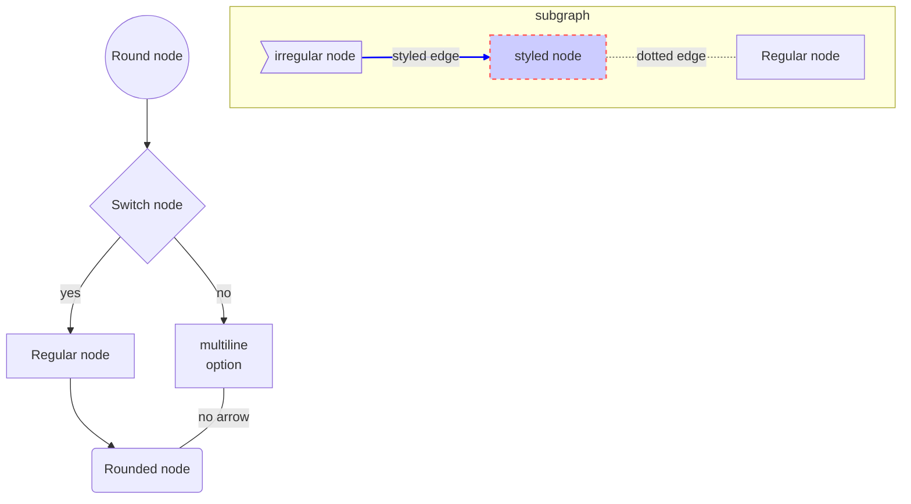

## 2019-08-07
---
### Mermaid flowcharts reference
Tag: *mermaid*, *markdown*, *flowcharts*

In compatible markdown readers [1] the following should plot a showcase of the main flowchart option for the mermaid library

Refs:
- [[1]](https://github.com/github/markup/issues/533) Github discussion on mermaid adoption in Github Markdown
- [[2]](https://mermaidjs.github.io/#/flowchart) Mermaid documentation

---

